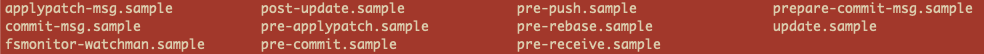

Title: Today I Learned: How to use Git Hooks for Better Code Quality
Date: 2020-06-29
Author: sshu
Category: Git
Slug: How to use Git Hooks for Better Code Quality
Status: published

I am aware of the existence of **[Git Hooks](https://git-scm.com/book/en/v2/Customizing-Git-Git-Hooks)** for quite a while but haven't really tried it out myself until today. Although it looks a simple thing to do, I did come across some *interesting* issues and had to do a little bit research. So why not share what I learned with the internet?

First, I created one simple Python script, ***encrypt.py***,  in which a function called ***encOnePassword*** is defined.

```python
import hashlib


def encOnePassword(rawPassword: str) -> str:
    """Encrypt one string by using SHA256 with *Salt*

    Args:
        x (string): Any password from user input
    """
    salt = "This is the SALT"

    # if I accidentally changed th salt
    # salt = "This is not the SALT to use!"

    return hashlib.sha256((salt + rawPassword).encode('utf-8')).hexdigest()
```

Then I created another simple test script ***test_encrypt.py***.

```python
import pytest
from encrypt import encOnePassword


def test_encOnePassword():
    assert encOnePassword(
        "1234567") == "9f9df71798d99794f643f7282d2b98c20a538ee0d307aa1b3d2387635c6ae52f"
    assert encOnePassword(
        "ABC_DEF") == "90da2f1901ff71c8ffdb314ce2621180d0169492ea9343bc1a9bb86bbfecd6b6"

```

Next, I ran the ***git init*** command and initialized a git repo. But when I looked into the ***.git/hooks/*** directory, there are a bunch of codes in there already! Well, that's something I didn't expect at all.



So I made a directory call ***backup*** and moved all these samples into it, so they won't interfere with what I plan to do next. Then I created a shell script called ***pre-commit.sh***.

```bash
#!/bin/bash
current_branch=`git branch |grep '*' |sed 's/* //'`

if [ "$current_branch" == "master" ]; then
    echo "Running tests pre-committ"
    python -m pytest test_*.py
    if [ $? -eq 0 ]; then
        echo "Tests all passed!"
        exit 0
    else
        echo "Tests failed ... Committ not successful!"
        exit 1
    fi
fi
```

**Here I referenced the codes from [Giacomo's blog](https://www.giacomodebidda.com/a-simple-git-hook-for-your-python-projects/) and changed it a little to fit my needs.*

When all of these are in place, I made the initial commit and it went smoothly. Then I changed the ***salt*** in the ***encOnePassword*** function, to mimic an unintentional bug, and commit the code again. I though the ***pre-commit*** hook would throw out an error and interrupt the commit, but ***IT DID NOT***! What a surprise!

After a little search on [stackoverflow](www.stacoverflow.com),I found [this answer](https://stackoverflow.com/questions/5084100/post-commit-hook-not-running) and did two things:

1. Changed the script name from `pre-commit.sh` to `pre-commit` (yes, remove the `.sh` part.)
2. Made the script an executable one by running `chmod +x pre-commit`.

Now, finally, the hook is working as I expected and it prevented me from committing bad codes to the master branch! Hooray!
