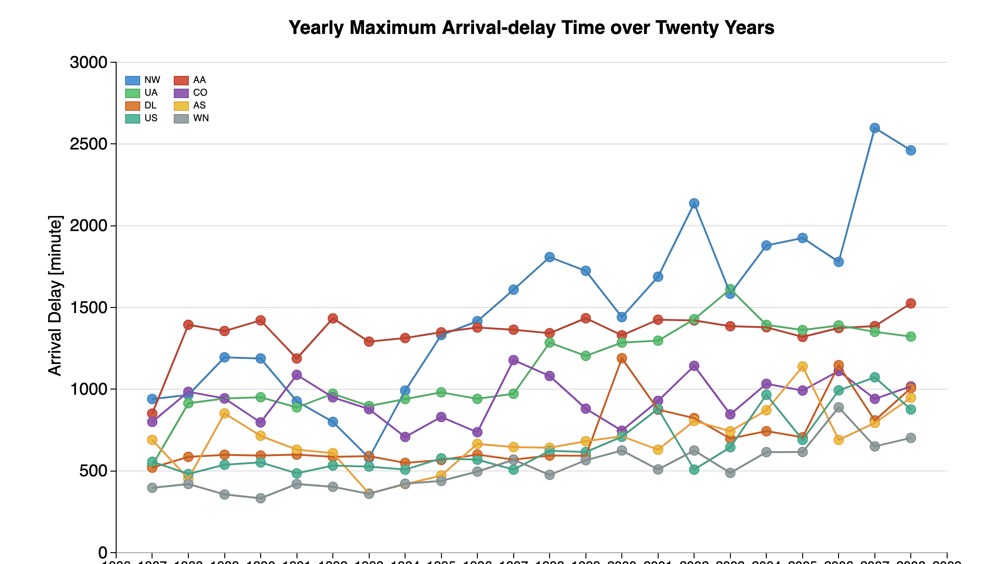

Title: Have Flights Delays decreased Over Time?
Date: 2016-05-07 06:33
Author: sshu
Category: Data visualization
Slug: have-flights-delays-decreased-over-time
Status: published

I think it is not just me who would think that, as technology advances, the flight carriers are able to reduce the arrival delay over time. Is that really the case? I looked into the historic flights data and found something surprising and interesting.

First I downloaded all the historic flights data from [stat-computing.org](http://stat-computing.org/dataexpo/2009/the-data.html).  These 22 years (1987 -2008) of data add up to be more than 10 GB. So I wrote [a piece of R code](https://github.com/shushi2016/DataViz1/blob/FlightsRepo/AggregateFlightsData_v3.R) which can read each csv file and extract the information I need for each carrier in each year.  I tried many different ways to aggregate the data, for example, using the yearly average, 75% quantile, 99% quantile, and the yearly maximum. Since there are so many flight records for each carrier each year, I only found the yearly maximum arrival delays had some clear trends over time.

Surprisingly, this exploratory data analysis suggested that the yearly maximum of arrival delays increased rather than decreased in these 22 years. This is somehow counter-intuitive to me because I thought the Information Technology has developed so much and should have helped to reduce the flights delay. Anyway, I used D3.js and created an interactive scatter-line plot to show these trends.  Below is a thumbnail of the plot, which is linked to the real html file where the plot is hosted. The legend is clickable so you can select which carriers' data you would like to see or not see.

**<a href="http://shushi2016.github.io/DataViz1/" target="_blank">HERE </a> is the link to the interactive chart.**

<div>




<br><br>

After making this plot and looking back into the data set, I realized it is reasonable that the yearly maximum arrival delays have increased in the past. The major reasons I can speculate includes:

1.  More and more people are taking airplanes to travel therefore there are a lot more flights to manage for each carrier.
2.  The number of longer distance flights increased and chances of longer arrival delay increased.
3.  The yearly maximum delay are probably caused by some extreme weather conditions or natural disasters, which seem to happen more frequently in recent years.


Full code of the interactive chart:

<br><br>

```html
<!DOCTYPE html>
<head>
<meta content="text/html;charset=utf-8" http-equiv="Content-Type">
<meta content="utf-8">
<link rel="stylesheet" type="text/css" href="style.css">
<title>Flights Arrival Delay</title>
<script src = "https://d3js.org/d3.v3.min.js"></script>
<script src = "http://dimplejs.org/dist/dimple.v2.1.6.min.js"></script>
<h1>Data Visualization Project</h1>
<h2>Historic Flights Data</h2>
</head>
<body>
<div id = "chartContainer"></div>
<script type="text/javascript">
  "use strict";
  var margin = 100;
  var width = 1200 - margin;
  var height = 700 - margin;
  var svg = dimple.newSvg("#chartContainer", width,height);

  d3.csv("YearlyMaxTotal.csv").row(function(d) {
    return {
      Count : +1,
      Year : d.Year,
      ArrDelay : d3.round(+d.ArrDelay,2),
      DepDelay : d.DepDelay,
      Carrier : d.UniqueCarrier
    };
    }).get(function(error, data) {
    var myChart = new dimple.chart(svg, data);
    //add legend
    var myLegend = myChart.addLegend(120, 80, 150, 300, "left");
    //define a color palette
    myChart.defaultColors = [
      new dimple.color("#3498db", "#2980b9", 1), // blue
      new dimple.color("#e74c3c", "#c0392b", 1), // red
      new dimple.color("#2ecc71", "#27ae60", 1), // green
      new dimple.color("#9b59b6", "#8e44ad", 1), // purple
      new dimple.color("#e67e22", "#d35400", 1), // orange
      new dimple.color("#f1c40f", "#f39c12", 1), // yellow
      new dimple.color("#1abc9c", "#16a085", 1), // turquoise
      new dimple.color("#95a5a6", "#7f8c8d", 1)  // gray
      ];
    // change to time series plot
    var x = myChart.addTimeAxis("x", "Year", "%Y", "%Y");
    x.overrideMin = d3.time.format("%Y").parse("1986");
    x.overrideMax = d3.time.format("%Y").parse("2009");
    x.ticks = 5;
    x.fontSize = "14px";
    var y1 = myChart.addMeasureAxis("y", "ArrDelay");
    y1.fontSize = "18px";
    y1.overrideMax = 3000;
    y1.tickFormat = "f";
    y1.ticks = 5;
    var dots = myChart.addSeries(["Index", "Carrier"], dimple.plot.scatter);
    var lines = myChart.addSeries(["Index", "Carrier"], dimple.plot.line);
    myChart.draw();
    // orphan the legend
    myChart.legends = [];
    var filterValues = dimple.getUniqueValues(data, "Carrier");
    myLegend.shapes.selectAll("rect")
      .on("click", function (e) {
        var hide = false;
        var newFilters = [];
        filterValues.forEach(function (f) {
          if (f === e.aggField.slice(-1)[0]) {
            hide = true;
          } else {
            newFilters.push(f);
          }
        });
        if (hide) {
          d3.select(this).style("opacity", 0.2);
        } else {
          newFilters.push(e.aggField.slice(-1)[0]);
          d3.select(this).style("opacity", 0.8);
        }
        filterValues = newFilters;
        myChart.data = dimple.filterData(data, "Carrier", filterValues);
        myChart.draw(40);
        y1.titleShape.text("Arrival Delay [minute]");
        x.titleShape.text("");
      });

    //fine-tune the axises
    y1.titleShape.text("Arrival Delay [minute]");
    x.titleShape.text("");
    svg.append("text")
   	  .attr("x", myChart._xPixels() + myChart._widthPixels() / 2)
   	  .attr("y", myChart._yPixels() - 30)
   	  .style("text-anchor", "middle")
   	  .style("font-family", "sans-serif")
   	  .style("font-weight", "bold")
   	  .text("Yearly Maximum Arrival-delay Time over Twenty Years");
    
	});
</script>
<div id = 'Text'><div>
  <p>The legend area is clcikable! Try it!</p>
  <p>Use Chrome or IE. For some reasons Firefox does not render the chart properly.</p>
</body>
```


If you come up with other possible reasons, please leave it in the comments!